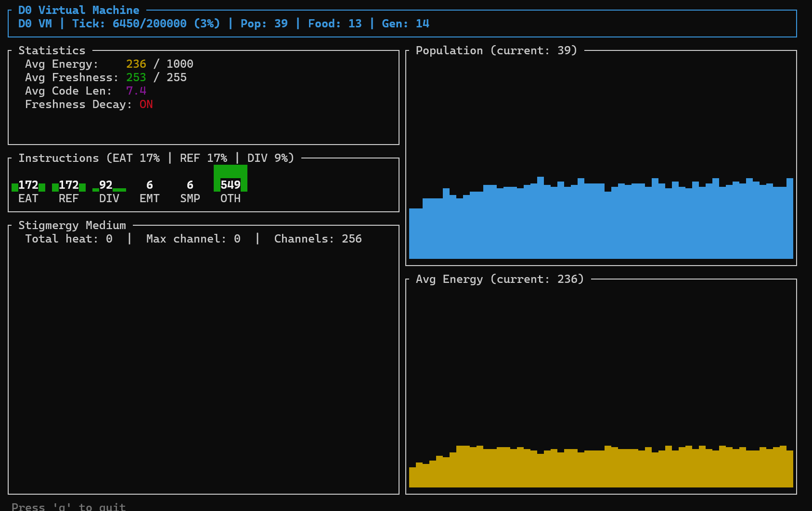

<h1 align="center">ExoMind Cell</h1>

<p align="center">
  <strong>Operational Closure Virtual Machine for Cognitive Life Science</strong>
</p>

<p align="center">
  <a href="https://github.com/exomind-team/exomind-cell/actions"></a>
  <a href="LICENSE"></a>
  <a href="https://github.com/exomind-team/exomind-cell/releases"></a>
</p>

<p align="center">
  A minimal artificial life virtual machine testing whether <strong>freshness decay</strong><br>
  (the constraint forcing organisms to actively maintain their own body)<br>
  drives the evolution of conditional survival-priority behavior.
</p>

<p align="center">
  
</p>

---

## Quick Start

```bash
# Interactive TUI
cargo run --release -- --tui --cell          # Cell v3 mode (recommended)
cargo run --release -- --tui                 # Classic v2 mode

# Headless experiments
cargo run --release -- --cell                # v3 cell experiments (5 seeds, 500k ticks)
cargo run --release -- --stats               # 100-seed parallel analysis (2M ticks)
cargo run --release -- --run-v2              # v2 global energy experiments

# Tests
cargo test                                   # 24 unit tests
```

## Features

- **Two VM architectures**: v2 (global energy) and v3 (per-cell freshness with Code/Energy/Stomach/Data cells)
- **14-instruction set**: NOP, INC, DEC, CMP, JMP, JNZ, LOAD, STORE, SENSE_SELF, EAT, REFRESH, DIVIDE, EMIT, SAMPLE
- **Stigmergy**: shared chemical medium for indirect organism communication
- **Interactive TUI**: real-time visualization with pause, step, speed control, organism inspector
- **Statistical analysis**: bootstrap CI, Mann-Whitney U, Kolmogorov-Smirnov test
- **Parallel execution**: rayon-powered multi-seed experiments (uses all CPU cores)
- **100-seed validation**: all behavioral metrics p<0.001

## TUI Controls

| Key | Action |
|-----|--------|
| `p` | Pause / Resume |
| `q` | Quit |
| `h` | Help overlay |
| `s` | Single step (when paused) |
| `i` | Inspect organism (cell-level detail) |
| `<` `>` | Navigate organisms in inspector |
| `+` `-` | Speed up / down (1-1000x) |

## Key Results

### 100-Seed Large-Scale (Cell v3, 2M ticks)

| Metric | Experimental | Control | p-value | Cohen's d |
|--------|-------------|---------|---------|----------|
| REFRESH ratio | 16.8% +/- 7.3% | 13.7% +/- 0.4% | <0.0001 | 0.59 |
| EAT ratio | 22.6% +/- 8.7% | 15.3% +/- 0.4% | <0.0001 | 1.19 |
| Population | 114 +/- 36 | 135 +/- 6 | 0.0001 | -0.78 |
| Avg Energy | 33.9 +/- 17.6 | 49.2 +/- 2.4 | <0.0001 | -1.22 |

REFRESH 95% CI [0.016, 0.044] excludes 0 -- the operational closure effect is statistically confirmed.

See [RESULTS.md](RESULTS.md) for full analysis. Experiment registry: [docs/experiments.md](docs/experiments.md).

## Architecture

```
src/
  instruction.rs  -- 14-instruction set + random/mutate/display
  organism.rs     -- v2 Organism, Config, seed programs (A/B/C)
  world.rs        -- v2 World simulation engine
  experiment.rs   -- v2 experiment runner, report generation
  cell_vm.rs      -- v3 Cell-based VM (Cell types, CellOrganism, CellWorld)
  stats.rs        -- Statistical tests (bootstrap, Mann-Whitney, KS)
  tui.rs          -- ratatui terminal visualization (v2 + Cell v3)
  main.rs         -- CLI entry point
data/             -- experiment CSV files and genome dumps
docs/
  design.md       -- VM architecture
  experiments.md  -- experiment registry (EXP-001 to EXP-007)
  gui-design-proposal.md -- future GUI design (egui/wgpu)
```

## Documentation

- [VM Design](docs/design.md) -- instruction set, organism structure, cell types
- [Experiment Registry](docs/experiments.md) -- all 7 experiments with parameters and results
- [GUI Proposal](docs/gui-design-proposal.md) -- future graphical interface design

## Tech Stack

- **Language**: Rust 2021
- **Dependencies**: `rand 0.8`, `rayon 1.10`, `ratatui 0.29`, `crossterm 0.28`
- **Tests**: 24 unit tests
- **CI**: GitHub Actions (build + test + clippy)

## License

[CCOPL-1.0](LICENSE) (Collective Commons Open Public License)
